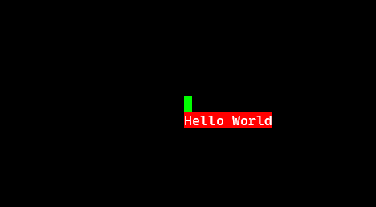

# teng 📟
<div align="center">

[![Crate Badge]][Crate] [![Repo Badge]][Repo] [![Docs Badge]][Docs] [![License Badge]][License]  \
[Docs] · [Examples]

</div>

A minimal, cross-platform game engine for the terminal in Rust


## Features
- Fast rendering by only printing changed pixels to the terminal
- Built-in FPS limiter
- Batteries included: Components for common tasks (e.g. input handling, FPS display, mouse interpolation, half block rendering)

## Getting Started
teng uses components as the building blocks. Every frame, each component (optionally):
- Handles received events (mouse, keyboard, resizes, etc.)
- Updates the game state
- Renders its core concept (if any) to the screen

Here's a simple example that renders static content to the screen:
```rust ,no_run
use std::io;
use teng::{install_panic_handler, terminal_cleanup, terminal_setup, Game, Pixel, Render, Renderer, SharedState};

struct MyComponent;

impl teng::Component for MyComponent {
    fn render(&self, mut renderer: &mut dyn Renderer, shared_state: &SharedState, depth_base: i32) {
        let width = shared_state.display_info.width();
        let height = shared_state.display_info.height();
        let x = width / 2;
        let y = height / 2;
        let pixel = Pixel::new('█').with_color([0, 255, 0]);
        renderer.render_pixel(x, y, pixel, depth_base);

        "Hello World".with_bg_color([255, 0, 0]).render(&mut renderer, x, y+1, depth_base);
    }
}

fn main() -> io::Result<()> {
    terminal_setup()?;
    install_panic_handler();

    let mut game = Game::new_with_custom_buf_writer();
    // If you don't install the recommended components, you will need to have your own
    // component that exits the process, since Ctrl-C does not work in raw mode.
    game.install_recommended_components();
    game.add_component(Box::new(MyComponent));
    game.run()?;

    terminal_cleanup()?;

    Ok(())
}
```
This results in the following:



## Showcase
See below for a clip of an unreleased game built in teng:
TODO: change relative links to absolute github blobs so they work in docs.rs too
TODO: record termill


## Is teng an ECS?
Not really. teng's "Components" are quite similar to "Systems" in an ECS, but there is no built-in notion of entities or components in the ECS sense.
However, you can build an ECS inside teng quite easily, see [`examples/ecs`](examples/ecs/main.rs) for an example.


[Repo]: https://github.com/skius/teng
[Docs]: https://docs.rs/teng
[Examples]: https://github.com/ratatui/ratatui/tree/main/examples
[Crate]: https://crates.io/crates/teng
[Crate Badge]: https://img.shields.io/crates/v/teng?logo=rust&style=flat-square&color=E05D44
[Repo Badge]: https://img.shields.io/badge/repo-skius/teng-3370D3?style=flat-square&logo=github
[License Badge]: https://img.shields.io/crates/l/teng?style=flat-square&color=1370D3
[Docs Badge]: https://img.shields.io/badge/docs-teng-1370D3?style=flat-square&logo=rust
[License]: ./LICENSE